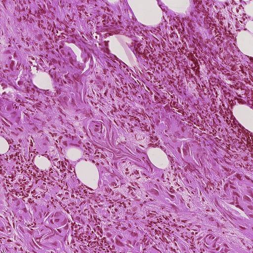

<h2>Tensorflow-Image-Segmentation-Augmented-CAMELYON-Resampled (Updated: 2024/07/01)</h2>

This is the first experiment of Image Segmentation for CAMELYON (CAncer MEtastases in LYmph nOdes challeNge)Resampled
 Images based on
the <a href="https://github.com/sarah-antillia/Tensorflow-Image-Segmentation-API">Tensorflow-Image-Segmentation-API</a>, and
Camelyon-ImageMask-Dataset 
<a href="https://drive.google.com/file/d/19TkTkyqNKF5SwwLwhrQefT6w5-S2sc82/view?usp=sharing">
Resampled-Camelyon-ImageMask-Dataset-512x512-blurred-17x17-JPG-V3.zip
</a>
, which was derived by us from <a href="https://www.kaggle.com/datasets/osmanf/camelyon-preprocessed">
Camelyon_preprocessed</a> in kaggle.com website.
  
<!--
On <b>Non-Tiled-Camelyon-ImageMask-Dataset</b>, please refer to <a href="https://github.com/sarah-antillia/Tiled-ImageMask-Dataset-Camelyon">
Tiled-ImageMask-Dataset-Camelyon</a> 
 -->
As mentioned in our previous experiment <a href="https://github.com/sarah-antillia/Tensorflow-Image-Segmentation-Augmented-CAMELYON">Tensorflow-Image-Segmentation-Augmented-CAMELYON</a>,

 the original ground truth masks look quite jagged, which seems to be far from the precise annotations.
A simple way to generate slightly better annotations (masks) is to apply the GaussianBlur operation to the original jagged mask 
to smooth out the edges of the masks. Of course, this is one of some possible approachs to improve the jagged annotation.  
 

We created the <a href="https://drive.google.com/file/d/19TkTkyqNKF5SwwLwhrQefT6w5-S2sc82/view?usp=sharing">Resampled ImageMask Dataset</a>
 using the following steps: 

1. Resampled the original <a href="https://www.kaggle.com/datasets/osmanf/camelyon-preprocessed"> Camelyon_preprocessed</a>
 dataset to reduce the number of images and masks in the test set 
and increase them in the training set. 
2. Applied a Gaussian blur with a kernel size of (17, 17) to the mask files in the resampled dataset.
  
 
You may also try an online blurring of masks by setting blur parameters in [mask] section in 
<a href="./projects/TensorflowSlightlyFlexibleUNet/Camelyon-Resampled/train_eval_infer.config">
train_eval_infer.config</a> file as shown below. 
<pre>
[mask]
blur      = True
blur_size = (17,17)
</pre>
This setting can be used for the first unblurred ImageMask-Dataset
<a href="https://drive.google.com/file/d/1X7Qx2hCBnXdM7-eh0t6YnyUYmnK2Wbj-/view?usp=sharing">Camelyon-ImageMask-Dataset-512x512-JPG-V1.zip</a>. 

 

<b>Actual Image Segmentation for 512x512 images.</b> 
 
<table>
<tr>
<th>Input: image</th>
<th>GaussianBlurred mask(ground_truth)</th>
<th>Prediction: inferred_mask</th>
</tr>
<tr>
<td></td>

<td></td>
<td></td>
</tr>

<tr>
<td></td>

<td></td>
<td></td>
</tr>
</table>

 
In this experiment, we used the simple UNet Model 
<a href="./src/TensorflowUNet.py">TensorflowSlightlyFlexibleUNet</a> for this Camelyon Segmentation. 
As shown in <a href="https://github.com/sarah-antillia/Tensorflow-Image-Segmentation-API">Tensorflow-Image-Segmentation-API</a>.
you may try other Tensorflow UNet Models: 

<li><a href="./src/TensorflowSwinUNet.py">TensorflowSwinUNet.py</a></li>
<li><a href="./src/TensorflowMultiResUNet.py">TensorflowMultiResUNet.py</a></li>
<li><a href="./src/TensorflowAttentionUNet.py">TensorflowAttentionUNet.py</a></li>
<li><a href="./src/TensorflowEfficientUNet.py">TensorflowEfficientUNet.py</a></li>
<li><a href="./src/TensorflowUNet3Plus.py">TensorflowUNet3Plus.py</a></li>
<li><a href="./src/TensorflowDeepLabV3Plus.py">TensorflowDeepLabV3Plus.py</a></li>

 

<h3>1. Dataset Citation</h3>
The original dataset used here has been taken from <a href="https://www.kaggle.com/datasets/osmanf/camelyon-preprocessed">
Camelyon_preprocessed</a> in kaggle.com website.
 
 
<b>About Dataset</b>
No description available 
 
On CAMELYON dataset, please refer to the following link  
<li><a href="https://camelyon16.grand-challenge.org/Data/">The CAMELYON16 challenge has ended in November 2016</a></li>
<li><a href="https://camelyon17.grand-challenge.org/"> CAMELYON17 </a></li>
 
Please see alo; 
<a href="https://registry.opendata.aws/camelyon/">CAncer MEtastases in LYmph nOdes challeNge (CAMELYON) Dataset</a> 
 
<b>Description</b>: 
"This dataset contains the all data for the CAncer MEtastases in LYmph nOdes challeNge or CAMELYON. CAMELYON was the first challenge using whole-slide images in computational pathology and aimed to help pathologists identify breast cancer metastases in sentinel lymph nodes. Lymph node metastases are extremely important to find, as they indicate that the cancer is no longer localized and systemic treatment might be warranted. Searching for these metastases in H&E-stained tissue is difficult and time-consuming and AI algorithms can play a role in helping make this faster and more accurate.
 
<b>License</b>: CC0  
 
<b>Documentation</b>: https://www.ncbi.nlm.nih.gov/pmc/articles/PMC6007545/ 
 

<h3>
<a id="2">
2 Camelyon ImageMask Dataset
</a>
</h3>
 If you would like to train this Camelyon Segmentation model by yourself,
 please download the dataset from the google drive  
 <a href="https://drive.google.com/file/d/19TkTkyqNKF5SwwLwhrQefT6w5-S2sc82/view?usp=sharing">
Resampled-Camelyon-ImageMask-Dataset-512x512-blurred-17x17-JPG-V3.zip
</a>
 
 
Please expand the downloaded ImageMaskDataset and place them under <b>./dataset</b> folder to be
<pre>
./dataset
└─Camelyon
    ├─test
    │   ├─images
    │   └─masks
    ├─train
    │   ├─images
    │   └─masks
    └─valid
        ├─images
        └─masks
</pre>
 

<b>Camelyon Dataset Statistics</b> 
 
 
As shown above, the number of images of train and valid dataset is not necessarily large. Therefore, probably an online augmentation strategy to
train this model may be effective to improve segmentation accuracy.
 

 
<b>Train_images_sample</b> 

 
<b>Train_masks_sample</b> 

 

<h3>
4 Train TensorflowUNet Model
</h3>
 We have trained Camelyon TensorflowUNet Model by using the following
<a href="./projects/TensorflowSlightlyFlexibleUNet/Camelyon-Resampled/train_eval_infer.config"> <b>train_eval_infer.config</b></a> file.  
Please move to ./projects/Camelyon-Resampled and run the following bat file. 
<pre>
>1.train.bat
</pre>
, which simply runs the following command. 
<pre>
>python ../../../src/TensorflowUNetTrainer.py ./train_eval_infer.config
</pre>
<pre>
; train_eval_infer.config
; 2024/07/01 (C) antillia.com

[model]
model         = "TensorflowUNet"
generator     = True
image_width    = 512
image_height   = 512
image_channels = 3
input_normalize = False
normalization  = False
num_classes    = 1
base_filters   = 16
base_kernels   = (7,7)
num_layers     = 8
dropout_rate   = 0.06
learning_rate  = 0.00008
clipvalue      = 0.5
dilation       = (2,2)
;loss           = "bce_iou_loss"
loss           = "bce_dice_loss"
metrics        = ["binary_accuracy"]
show_summary   = False

[train]
epochs        = 100
batch_size    = 2
steps_per_epoch  = 400
validation_steps = 80
patience      = 10

;metrics       = ["iou_coef", "val_iou_coef"]
metrics       = ["binary_accuracy", "val_binary_accuracy"]
model_dir     = "./models"
eval_dir      = "./eval"
image_datapath = "../../../dataset//Camelyon-Resampled/train/images/"
mask_datapath  = "../../../dataset//Camelyon-Resampled/train/masks/"

;Inference execution flag on epoch_changed
epoch_change_infer     = True

; Output dir to save the inferred masks on epoch_changed
epoch_change_infer_dir =  "./epoch_change_infer"

;Tiled-inference execution flag on epoch_changed
epoch_change_tiledinfer     = False

; Output dir to save the tiled-inferred masks on epoch_changed
epoch_change_tiledinfer_dir =  "./epoch_change_tiledinfer"

; The number of the images to be inferred on epoch_changed.
num_infer_images       = 1
create_backup  = False

learning_rate_reducer = True
reducer_factor     = 0.3
reducer_patience   = 4
save_weights_only  = True

[eval]
image_datapath = "../../../dataset//Camelyon-Resampled/valid/images/"
mask_datapath  = "../../../dataset//Camelyon-Resampled/valid/masks/"

[test] 
;image_datapath = "./mini_test/images/"
;mask_datapath  = "./mini_test/masks/"
image_datapath = "../../../dataset//Camelyon-Resampled/test/images/"
mask_datapath  = "../../../dataset//Camelyon-Resampled/test/masks/"

[infer] 
images_dir    = "./mini_test/images"
output_dir    = "./mini_test_output"
merged_dir    = "./mini_test_output_merged"
;blur          = True

[tiledinfer] 
overlapping   = 128
images_dir    = "./mini_test/Metaplastic/images"
output_dir    = "./tiled_mini_test_output"
merged_dir    = "./tiled_mini_test_output_merged"
bitwise_blending = False

;binarize      = True
mask_colorize = True

[segmentation]
colorize      = False
black         = "black"
white         = "green"
blursize      = None

[mask]
blur      = False
blur_size = (3,3)
binarize  = False
;threshold = 128
threshold = 80

[generator]
debug        = False
augmentation = True

[augmentor]
vflip    = True
hflip    = True
rotation = True
angles   = [30, 60, 90, 120, 150, 180, 210, 240, 270, 300, 330]
shrinks  = [0.6, 0.8]
shears   = [0.1]

deformation = True
distortion  = True
sharpening  = False
brightening = False

barrdistortion = False

[deformation]
alpah    = 1300
sigmoids  = [8.0]

[distortion]
gaussian_filter_rsigma= 40
gaussian_filter_sigma = 0.5
distortions           = [0.02, 0.03]

[barrdistortion]
radius = 0.3
amount = 0.3
centers =  [(0.3, 0.3), (0.5, 0.5), (0.7, 0.7)]

[sharpening]
k        = 1.0

[brightening]
alpha  = 1.2
beta   = 10  
</pre>
In this configuration file above, we added the following parameters to enable <b>epoch_change_infer</b> callback in [train] section. 
<pre>
[train]
;Inference execution flag on epoch_changed
epoch_change_infer     = True
; Output dir to save the inferred masks on epoch_changed
epoch_change_infer_dir =  "./epoch_change_infer"

; The number of the images to be inferred on epoch_changed.
num_infer_images       = 1
</pre>

By using this callback, on every epoch_change, the inference procedures can be called
 for an image in <b>mini_test</b> folder.  
<b>Epoch_change_inference output</b> 
 
 
 
The training process has just been stopped at epoch 23 by an early-stopping callback as shown below.  
 
 
 
<a href="./projects/TensorflowSlightlyFlexibleUNet/Camelyon-Resampled/eval/train_metrics.csv">train_metrics.csv</a> 
 

 
<a href="./projects/TensorflowSlightlyFlexibleUNet/Camelyon-Resampled/eval/train_losses.csv">train_losses.csv</a> 
 
 

<h3>
5 Evaluation
</h3>
Please move to a <b>./projects/TensorflowSlightlyFlexibleUNet/Camelyon-Resampled</b> folder, 
and run the following bat file to evaluate TensorflowUNet model for Camelyon. 
<pre>
./2.evaluate.bat
</pre>
<pre>
python ../../../src/TensorflowUNetEvaluator.py ./train_eval_infer_aug.config
</pre>
Evaluation console output: 

  
<a href="./projects/TensorflowSlightlyFlexibleUNet/Camelyon-Resampled/evaluation.csv">evaluation.csv</a> 
The loss (bce_dice_loss) and binary_accuracy for this mini_test dataset were slightly improved fromt the previous result. 

<pre>
loss,0.4634
binary_accuracy,0.7792
</pre>
previous result of <a href="https://github.com/sarah-antillia/Tensorflow-Image-Segmentation-Augmented-CAMELYON">
CAMELYON Non-Resampled </a>
 
<pre>
loss,0.546
binary_accuracy,0.7113
</pre>

 
<h3>
6 Inference
</h3>
Please move to a <b>./projects/TensorflowSlightlyFlexibleUNet/Camelyon-Resampled</b> folder
, and run the following bat file to infer segmentation regions for the images 
in <a href="./projects/TensorflowSlightlyFlexibleUNet/Camelyon-Resampled/mini_test/images"><b>mini_test/images</b></a> by the Trained-TensorflowUNet model for Camelyon. 
<pre>
./3.infer.bat
</pre>
<pre>
python ../../../src/TensorflowUNetInferencer.py ./train_eval_infer_aug.config
</pre>
The <a href="./projects/TensorflowSlightlyFlexibleUNet/Camelyon-Resampled/mini_test/"><b>mini_test</b></a>
folder contains some large image and mask files taken from the original BCSS dataset.  

<b>mini_test_images</b> 
 
 
<b>mini_test_mask(ground_truth)</b> 
 

<b>inferred test masks</b> 
 
 

<b>Enlarged Masks Comparison</b> 

<table>
<tr>
<th>Image</th>
<th>Mask (ground_truth)</th>
<th>Inferred-mask</th>
</tr>

<tr>
<td></td>
<td></td>
<td></td>
</tr>

<tr>
<td></td>
<td></td>
<td></td>
</tr>

<tr>
<td></td>
<td></td>
<td></td>
</tr>

<tr>
<td></td>
<td></td>
<td></td>
</tr>

<tr>
<td></td>
<td></td>
<td></td>
</tr>
</table>
 

<h3>
References
</h3>
<b>1. Accurate diagnostic tissue segmentation and concurrent disease subtyping with small datasets</b> 
https://doi.org/10.1016/j.jpi.2022.100174 
Steven J. Frank 
<pre>
https://www.sciencedirect.com/science/article/pii/S215335392200774X
</pre>
 
<b>2. Deep Learning Pipeline for Camelyon 2016 dataset</b> 
Weizhe Li  
<pre>
https://github.com/3dimaging/DeepLearningCamelyon
</pre>

 
<b>2. WSI tumor regions segmentation</b> 
Dalí Freire  
<pre>
https://github.com/dalifreire/tumor_regions_segmentation
</pre>
 
<b>4. Tensorflow-Image-Segmentation-Augmented-CAMELYON</b> 
Toshiyuki Arai @antillia.com  
<pre>

https://github.com/sarah-antillia/Tensorflow-Image-Segmentation-Augmented-CAMELYON
</pre>

